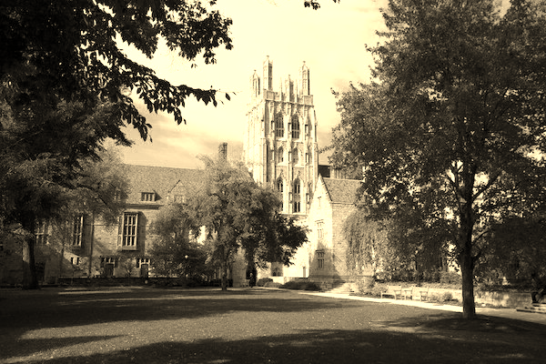

# Filter
## Background
This project was done by myself, Bianca Kendall, while taking part in a self-paced online HarvardX course called CS50x (Introduction to Computer Science). The project instructions were given in the course as copied below.

    Implement the functions in helpers.c such that a user can apply grayscale, sepia, reflection, or blur filters to their images.

    The function grayscale should take an image and turn it into a black-and-white version of the same image.
    The function sepia should take an image and turn it into a sepia version of the same image.
    The reflect function should take an image and reflect it horizontally.
    Finally, the blur function should take an image and turn it into a box-blurred version of the same image.
    You should not modify any of the function signatures, nor should you modify any other files other than helpers.c.

## Files
The main file that is run is **filter.c** (refer to Usage for run instructions). There are files for **helpers.c**, **helpers.h**, and **bmp.h**. The **helpers.c** file contains all the code to execute the desired changes to the images. There are also folders containing the original images (on which to test the program) and the images with various filters applied to them (output by the program).

## Usage
The program is first compiled using,

    $ make filter
Then, the program can be run by specifying the input image, the filter to apply, and the name of the file to be output with the applied filter. The followng examples are provided.

`$ ./filter -g infile.bmp outfile.bmp` (applies a grayscale to the image)

`$ ./filter -s infile.bmp outfile.bmp` (applies a sepia to the image)

`$ ./filter -r infile.bmp outfile.bmp` (reflects the image)

`$ ./filter -b infile.bmp outfile.bmp` (blurs the image)

The code can be tested on the provided images as shown below. This will produce a file called BlurYard.bmp, which will be a grayscale version of the original image. 

    $ ./filter -g images_original/courtyard.bmp SepiaCourtyard.bmp

